<div align="center">

  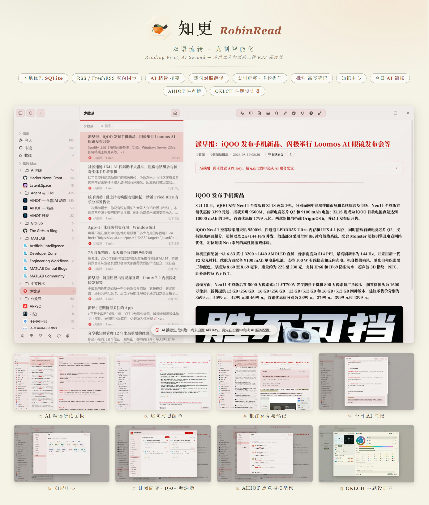

  # 知更 RobinRead

  ***双语流转，克制智能化。Reading First, AI Second.***

  本地优先、AI 增强的纸感三栏 RSS 阅读器（Windows / Electron）

  [](https://github.com/suzike/RobinRead/releases/latest)
  [](LICENSE)
  [](https://github.com/suzike/RobinRead/releases/latest)
  [](https://www.electronjs.org/)
  [](https://ronbinread-d9gmsqi2vc0a18f04-1401273698.tcloudbaseapp.com/)

  [官方网站](https://ronbinread-d9gmsqi2vc0a18f04-1401273698.tcloudbaseapp.com/) · [下载安装](#-下载安装) · [版本记录](#-版本记录) · [问题反馈](../../issues)

</div>

---

## 这是什么

知更（RobinRead）把散落的订阅还原为一个安静、清晰的三栏阅读空间：左侧订阅、中间文章列表、右侧衬线排版的阅读区。数据全部保存在本机（SQLite），不经过任何第三方服务器；AI 只在真正有帮助的地方出现——摘要、对照翻译、划词解释、批注辅助，而不是替你阅读。

## 功能一览

### 纸感三栏 · 沉浸阅读

<div align="center">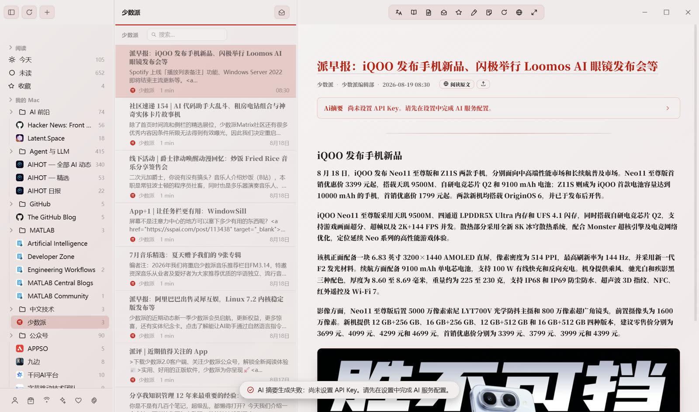</div>

- 三栏纸感布局、衬线排版、纸纹噪点，明暗两套默认主题
- 章节导航轨道（TOC Rail）、浮动滚动条、空格翻篇、禅模式
- 阅读位置记忆：切走再回来，停在上次读到的段落
- 网页正文一键重排：内置 [Mozilla Readability](https://github.com/mozilla/readability) 提取，烂排版、反爬壳页也能读

### AI 精读研读面板

<div align="center">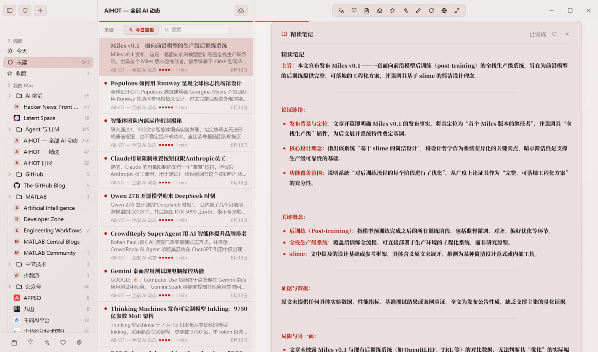</div>

- 按需生成流式研读笔记：主旨、论证脉络、关键概念、证据与数据、局限与另一面
- 全文摘要折叠卡片，读完要点再决定要不要精读
- 划词即问：解释、翻译、多轮追问，不打断阅读

### 逐句对照翻译

<div align="center">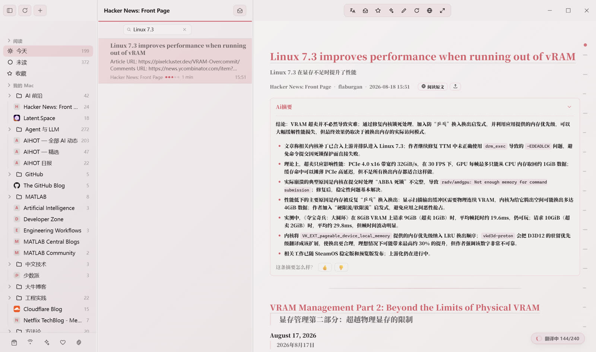</div>

- 一键开启后逐句生成译文，原文与中文并排显示，保留原文语感
- 适合外文长文与技术博客的精读场景

### 批注：高亮与笔记

<div align="center">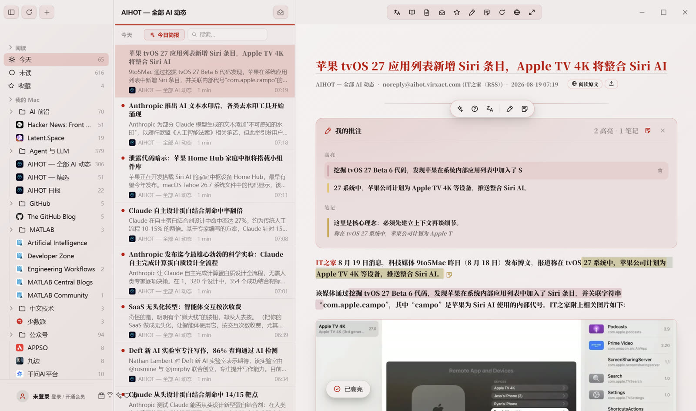</div>

- 五种纸感色高亮（黄 / 绿 / 蓝 / 粉 / 紫），选区浮窗即点即标
- 段落便签卡、批注总览面板，支持折叠；重排/重开后自动回锚
- `H` 键秒打黄色高亮，收藏与批注互不打扰

### 今日 AI 简报

<div align="center">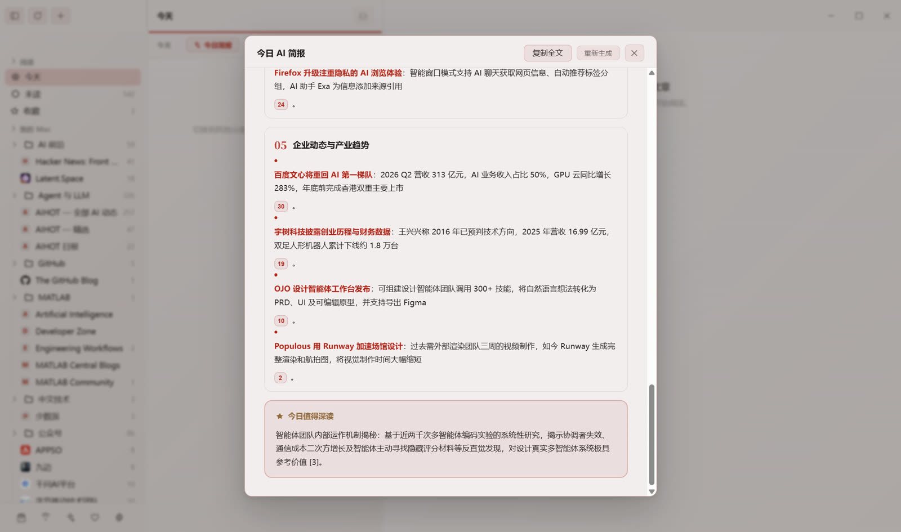</div>

- 把当天订阅更新按主题分组汇总，附「今日值得深读」推荐
- 一键复制全文，适合写日报、晨会速览

### 知识中心

<div align="center">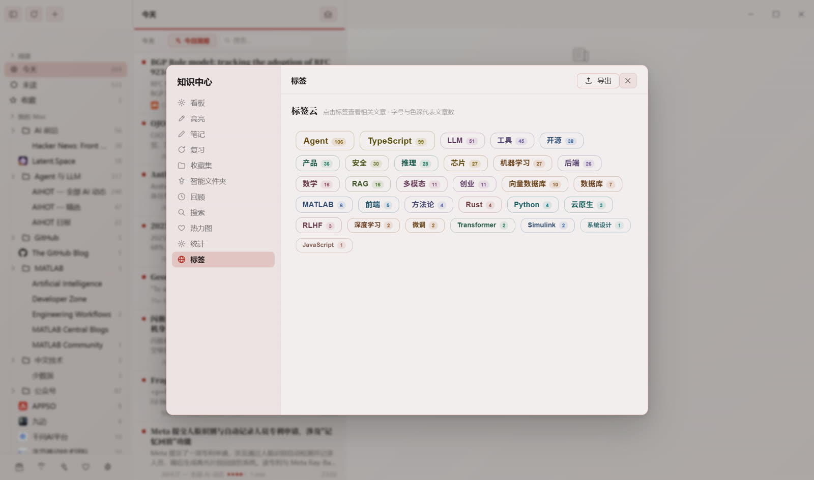</div>

- 标签云、看板、复习卡片、收藏集、热力图，沉淀你的阅读足迹
- 高亮与笔记自动归档，可导出

### 订阅商店

<div align="center">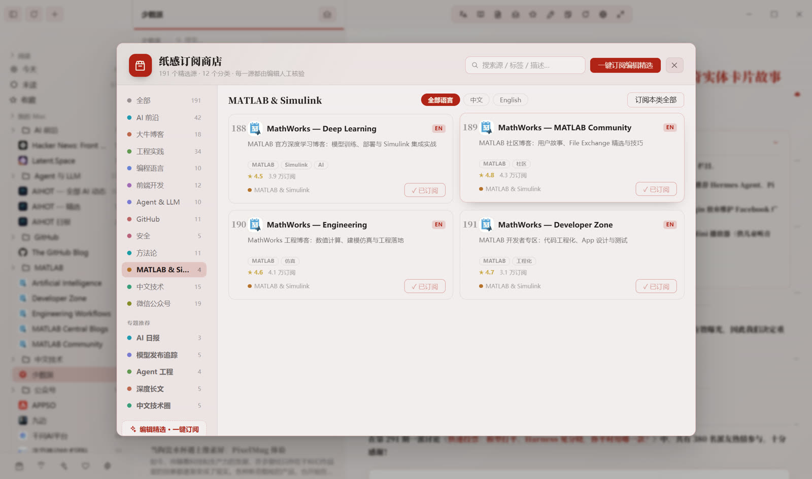</div>

- 内置 **300+ 精选源**、12 个分类（含 160+ 中文独立博客），支持编辑精选一键订阅；源健康自动标注
- **AI 探索**：输入感兴趣的关键词，AI 去全网发现目录之外的新源——本地验证后以卡片流呈现（更新频率 / 内容深度 / 样章预览 / 推荐理由），「换一批」持续换新
- 本地账户 + FreshRSS / Miniflux（Google Reader API）多账户：未读/星标双向同步、离线变更队列
- OPML 导入导出（保留文件夹层级）、ETag 条件刷新（省流量、对源站友好）；抓取走系统代理，被屏蔽的源也可达

### AIHOT 热点中心

<div align="center">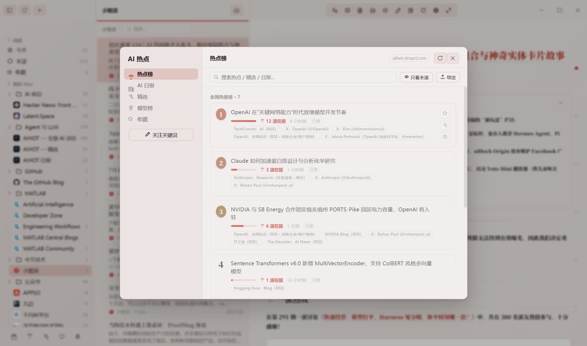</div>

<div align="center">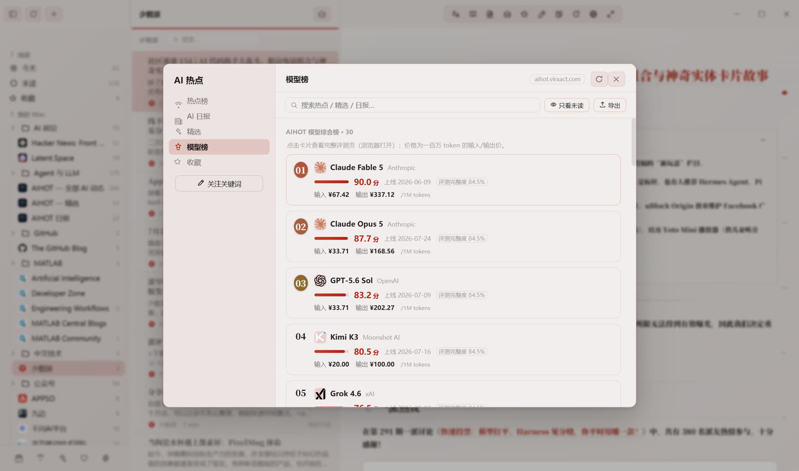</div>

- 全网 AI 热点榜、AI 日报、编辑部精选，热搜来源与在报媒体一目了然
- 大模型综合榜：评分、上线时间、百万 token 输入/输出价格
- 关注关键词，热点自动盯梢；文章打开前预抓取，秒开

### OKLCH 主题设计器

<div align="center">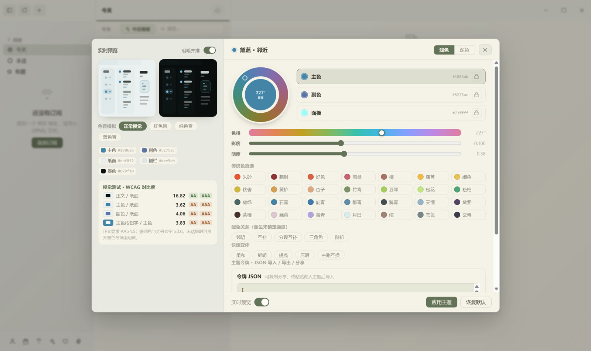</div>

- 基于 OKLCH 色彩空间调色，内置全套中国传统色（朱砂、胭脂、竹青、黛绿、月白……）
- 色觉障碍模拟（红/绿/蓝色盲）、WCAG 对比度实时检测
- 明暗并排实时预览，主题令牌 JSON 导入 / 导出 / 分享

### 还有这些细节

- **TTS 听文章**：本地语音离线朗读，按句跟随高亮，语速与声音可调（`R` 键读 / 停）
- **稍后读队列**：与收藏独立的第三状态，读累的文章先存起来慢慢消化
- **AI 探索**：见上方「订阅商店」——输入关键词，AI 去全网发现值得订阅的新源
- **系统托盘**：关闭到托盘常驻后台，刷新发现新文章时系统通知，支持开机自启
- **备份与恢复**：全量数据一键导出为单文件 JSON，随时恢复；存储体积统计与一键清理
- 中英双语界面，`Ctrl+/` 随时呼出快捷键帮助
- 凭据使用 Windows DPAPI 加密存储，AI API Key 不出本机
- 模型接入：DeepSeek / 任意 OpenAI 兼容 API / 可信局域网 HTTP 服务
- 旧版本升级自动迁移数据目录、偏好与阅读状态，不覆盖新数据

## ⌨️ 键盘快捷键

| 键 | 动作 |
| --- | --- |
| `C` | 开启 / 关闭逐句对照翻译 |
| `V` | 查看 / 生成 AI 摘要 |
| `H` | 快速黄色高亮 |
| `B` `B` | 上一篇（再按一次确认，不循环） |
| `N` `N` | 下一篇（再按一次确认，不循环） |
| `M` | 收藏 / 取消收藏 |
| `R` | 开始 / 停止朗读 |
| `Space` | 向下阅读；到底后切换下一篇 |
| `←` `→` | 三栏之间移动焦点 |
| `Ctrl+Shift+R` | 刷新全部订阅 |
| `Ctrl + / − / 0` | 正文字号 放大 / 缩小 / 重置 |
| `Ctrl+/` | 快捷键帮助 |

## 📥 下载安装

前往 [**Releases**](https://github.com/suzike/RobinRead/releases/latest) 下载：

| 文件 | 说明 |
| --- | --- |
| `RobinRead-x.y.z-setup.exe` | 安装版，支持自定义安装目录 |
| `RobinRead-x.y.z-portable.exe` | 便携版，解压即用，不写注册表 |

也可以在[官方网站](https://ronbinread-d9gmsqi2vc0a18f04-1401273698.tcloudbaseapp.com/)下载（附 SHA-256 校验值）。

> 免费版可用 30 个订阅源、每日 3 次 AI 调用；划词翻译与解释不受限制。会员方案见官网。

系统要求：Windows 10 / 11（x64）。

## 🛠 从源码运行

要求：Node.js 20+（建议 22+）、npm。

```bash
git clone https://github.com/suzike/RobinRead.git
cd RobinRead
npm install
npm start          # 开发运行
npm run dist       # 打包 Windows 安装包 + 便携版（输出到 dist/）
```

首次运行会自动创建本地账户；在工具栏「+」添加 RSS 订阅或导入 OPML，在「设置 → 账号」绑定 FreshRSS，在「设置 → AI 功能」配置 API Key 后启用 AI 能力。

## 📁 目录结构

```
src/
  main/                     # Electron 主进程
    AppStore.js             # 业务中枢
    Models.js               # 数据模型与纯函数
    FeedParser.js           # RSS / Atom / JSON Feed 解析
    FeedService.js          # ETag 条件抓取
    OPMLService.js          # OPML 导入导出
    ArticleExtractor.js     # 网页正文提取 + HTML 白名单消毒
    LLMService.js           # OpenAI 兼容流式客户端 + ArticleChunker
    AihotService.js         # AIHOT 热点/日报/精选/模型榜
    KnowledgeEngine.js      # 知识中心
    EvolutionEngine.js      # 阅读进化
    I18N.js / I18NStrings.js# 中英双语
    UpdateCheckService.js   # 更新检查（默认离线，可自建更新源）
    Account/                # 凭据存储（DPAPI/safeStorage）
    FreshRSS/               # Google Reader API 客户端与认证
    Persistence/            # SQLite（node:sqlite）+ 迁移 + 仓库 + TimelineQueryService
  renderer/                 # 三栏 UI
    views/                  # sidebar / list / reader / settings / store / aihot / knowledge
    styles/robin.css        # 纸感主题（OKLCH 变量驱动）
scripts/
  selftest.js               # 自检（解析/持久化/查询/消毒/UI）
  uitest.js                 # 端到端 UI 交互测试
  verify-realrun.js         # 真机可视全量回归（生产数据副本 + 截图取证）
server/                     # 本地联调服务器（会员/激活 API 的零依赖 mock）
cloudfunctions/njpaper-api  # 云函数版后端（微信登录 / 支付 / 激活码）
website/                    # 官网源码（CloudBase 静态托管）
```

## 🔒 数据与隐私

订阅、文章、阅读状态、批注、AI 配置全部保存在 `%APPDATA%\RobinRead`，卸载不残留云端副本。从旧版本升级时，数据会在首次启动自动迁移，不覆盖新数据。AI 调用直连你配置的模型服务商，本应用不经手、不存储。

## 🏷 版本记录

版本以 GitHub Release 标签管理，与应用版本号保持一致，发布页附带安装包与更新说明：

- **[v2.4.2 — 公众号刷新修复](https://github.com/suzike/RobinRead/releases/tag/v2.4.2)**（2026-08-31）：抓取走系统代理，被屏蔽的公众号桥与境外源可达；手动刷新强制全量
- **[v2.4.1 — AI 探索领域词修复](https://github.com/suzike/RobinRead/releases/tag/v2.4.1)**（2026-08-31）：候选池覆盖不足的领域由 AI 外扩提议站点
- **[v2.4.0 — AI 探索与全场景阅读](https://github.com/suzike/RobinRead/releases/tag/v2.4.0)**（2026-08-31）：AI 探索、TTS 听文章、稍后读、Miniflux 同步、托盘与备份、英文界面全量
- **[v2.3.0 — 性能与阅读体验跃升](https://github.com/suzike/RobinRead/releases/tag/v2.3.0)**（2026-08-31）：13 项缺陷修复、抓取独立进程、状态推送瘦身、FTS5 全文搜索
- **[v2.2.0 — 开源基线](https://github.com/suzike/RobinRead/releases/tag/v2.2.0)**（2026-08-29）：仓库首个 Release，与客户端构建 v2.2.0 同版本号
- 更早的构建历史见 [CHANGELOG.md](CHANGELOG.md)

## 📄 许可证

本项目基于 [GPL-3.0](LICENSE) 协议开源，欢迎自由使用、修改与二次分发。

<div align="center">
  <sub><a href="https://ronbinread-d9gmsqi2vc0a18f04-1401273698.tcloudbaseapp.com/">ronbinread · tcloudbaseapp.com</a> — 双语流转，克制智能化</sub>
</div>
