<div align="center">

  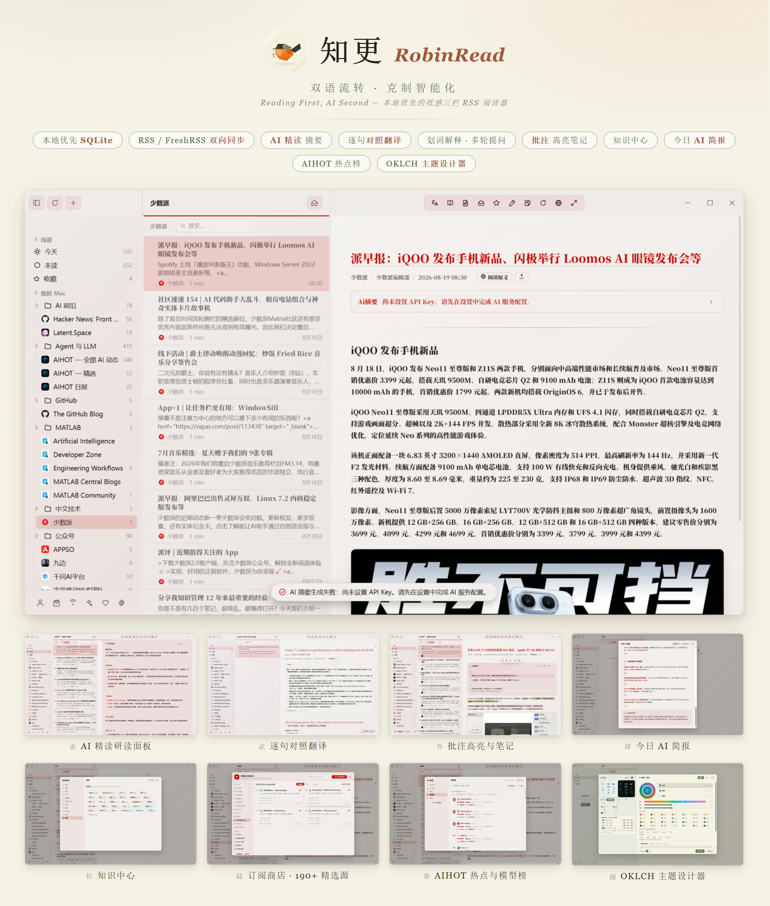

  # 知更 RobinRead

  ***双语流转，克制智能化。Reading First, AI Second.***

  本地优先、AI 增强的纸感三栏 RSS 阅读器（Windows / Electron）

  [](https://github.com/suzike/RobinRead/releases/latest)
  [](LICENSE)
  [](https://github.com/suzike/RobinRead/releases/latest)
  [](https://www.electronjs.org/)
  [](https://ronbinread-d9gmsqi2vc0a18f04-1401273698.tcloudbaseapp.com/)

  [官方网站](https://ronbinread-d9gmsqi2vc0a18f04-1401273698.tcloudbaseapp.com/) · [下载安装](#-下载安装) · [版本记录](#-版本记录) · [问题反馈](../../issues)

</div>

---

## 这是什么

知更（RobinRead）把散落的订阅还原为一个安静、清晰的三栏阅读空间：左侧订阅、中间文章列表、右侧衬线排版的阅读区。数据全部保存在本机（SQLite），不经过任何第三方服务器；AI 只在真正有帮助的地方出现——摘要、对照翻译、划词解释、批注辅助，而不是替你阅读。

## 功能一览

### 纸感三栏 · 沉浸阅读

<div align="center">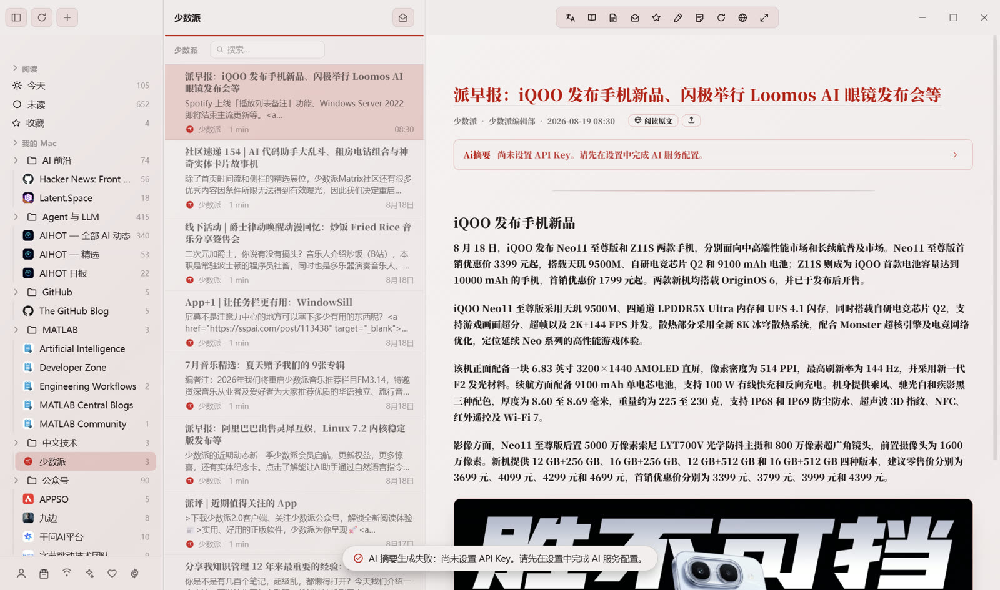</div>

- 三栏纸感布局、衬线排版、纸纹噪点，明暗两套默认主题
- **沉浸杂志视图**：列表 ⇄ 封面卡片杂志一键切换（列表顶部按钮），方向键遥控式移动，翻篇带纸页翻转动效
- 章节导航轨道（TOC Rail）、浮动滚动条、空格翻篇、禅模式
- 阅读位置记忆：切走再回来，停在上次读到的段落
- 网页正文一键重排：内置 [Mozilla Readability](https://github.com/mozilla/readability) 提取，烂排版、反爬壳页也能读

### AI 精读研读面板

<div align="center">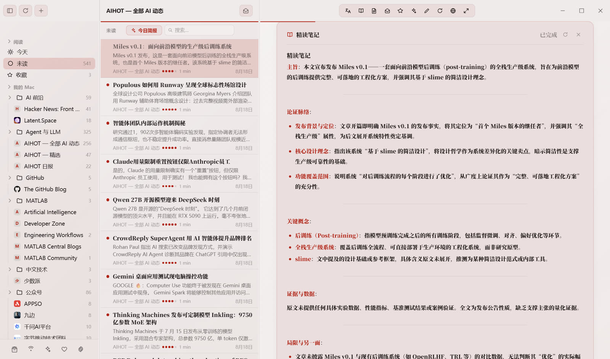</div>

- 按需生成流式研读笔记：主旨、论证脉络、关键概念、证据与数据、局限与另一面
- 全文摘要折叠卡片，读完要点再决定要不要精读
- 划词即问：解释、翻译、多轮追问，不打断阅读

### 精读卡片一键导出

<div align="center">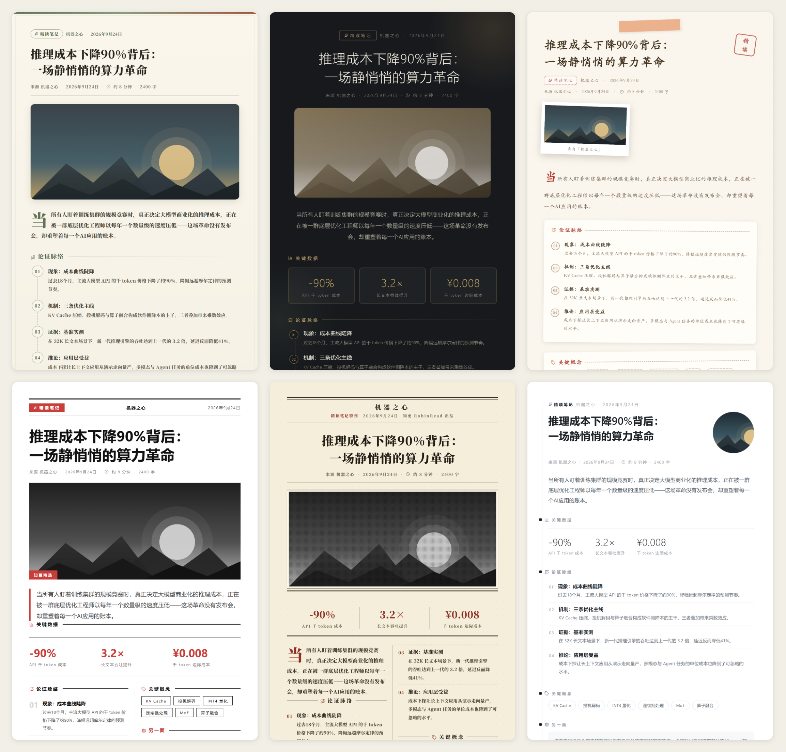</div>

- 精读笔记 / 高质量摘要 / AI 摘要一键导出高清卡片图（2x/3x，文字矢量级锐利），保存 PNG 或直接复制到剪贴板分享
- 六款精心排版的模板可选：知更书页、墨岩（暗色海报）、杂志编辑（双栏）、晨读手帖（楷体手账）、极简白、晚报（报纸风），画幅支持自适应 / 3:4 / 9:16
- 卡片自包含完整信息：文章标题、订阅源、日期、原文二维码、配图与关键数据高亮卡，无封面文章自动生成装饰头图

### 报纸级中文排版 · 每日刊

<div align="center">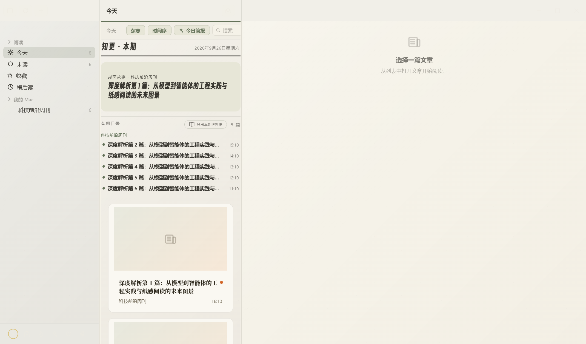</div>

- **排版引擎 v2**：段落风格（空行式 / 首行缩进两字）、两端对齐、字距三档、首字下沉、标题字体独立选字，全部实时生效
- **每源排版偏好**：源右键菜单可为单个订阅源覆盖字体 / 字号 / 页宽，公众号等排版欠佳的源单独调教
- **中文微排版**：中西文相邻自动加 1/4 字宽间隙（盘古之白）+ 行首行尾标点挤压，遵循 W3C《中文排版需求》；只改版面不改文字，复制 / 搜索 / 批注锚点零影响
- **内置开源字库**：霞鹜文楷 Screen（文艺正文）与得意黑（大标题）离线随包，OFL 授权，无需安装字体
- **每日刊头**：杂志视图自动排版出「一期」——封面故事、按来源分栏的本期目录，刊期随最新文章滚动
- **整期 / 单篇 EPUB 导出**：把当前列表打包成一本带目录的 EPUB 电子书（≤40 篇），单篇文章也可一键导出随身阅读
- **同题 AI 对比速读**：多源同题报道一键生成「一句话结论 / 各源侧重 / 分歧与互补」，来源编号点击跳原文

### 逐句对照翻译

<div align="center">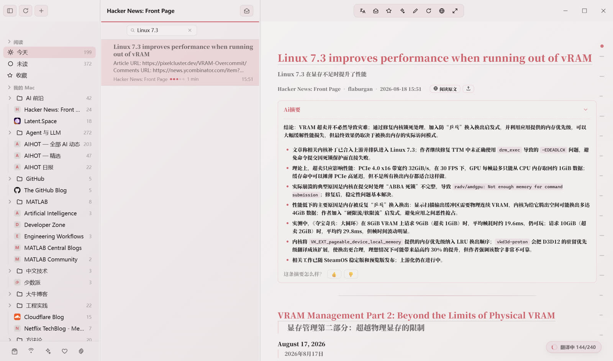</div>

- 一键开启后逐句生成译文，原文与中文并排显示，保留原文语感
- 每个订阅源可单独设置「总是 / 从不 / 跟随默认」翻译（源右键菜单）；手动关掉的文章不再自动翻
- 适合外文长文与技术博客的精读场景

### 批注：高亮与笔记

<div align="center">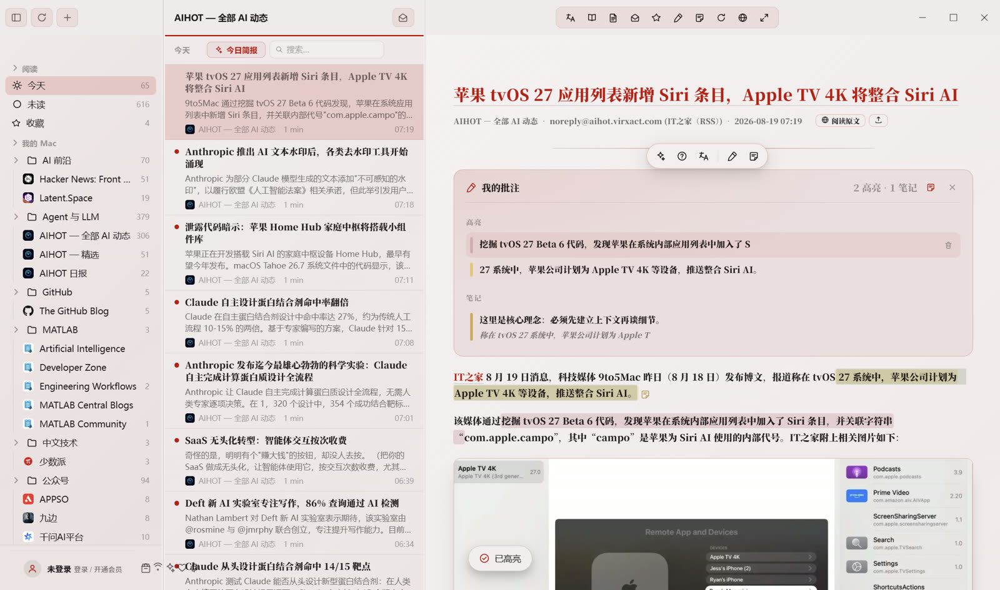</div>

- 五种纸感色高亮（黄 / 绿 / 蓝 / 粉 / 紫），选区浮窗即点即标
- 段落便签卡、批注总览面板，支持折叠；重排/重开后自动回锚
- `H` 键秒打黄色高亮，收藏与批注互不打扰

### 今日 AI 简报

<div align="center">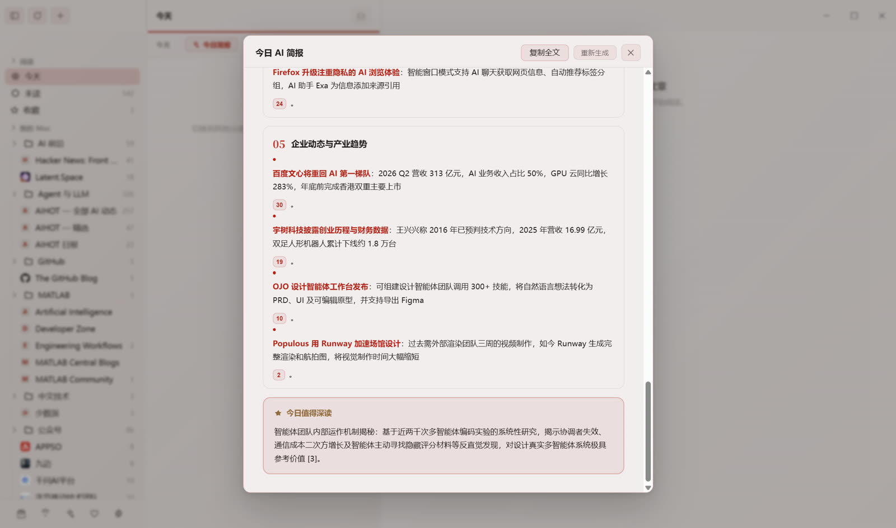</div>

- 把当天订阅更新按主题分组汇总，附「今日值得深读」推荐
- 一键复制全文，适合写日报、晨会速览

### 知识中心

<div align="center">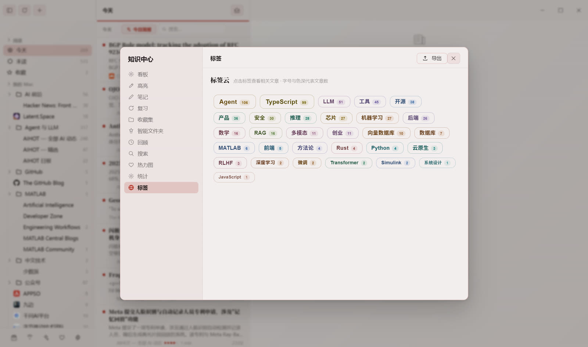</div>

- 标签云、看板、复习卡片、收藏集、热力图，沉淀你的阅读足迹
- 高亮与笔记自动归档，可导出
- **复习会话**：SM-2 记忆曲线调度，专注单卡流「忘了 / 想起来了 / 简单」三档评分
- **知识图谱**：标签 ↔ 文章关系力导向图，拖拽重摆、悬停看关联、点击直达原文
- **问知识库**：以你的高亮与笔记为材料作答，引用编号可跳回来源

### 订阅商店

<div align="center">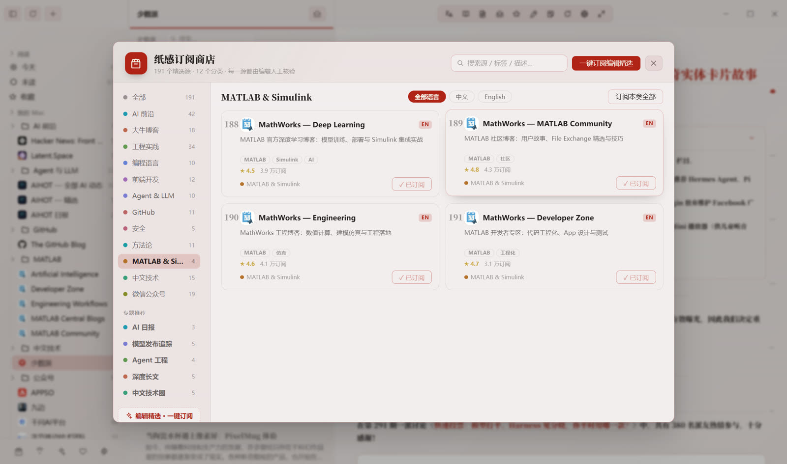</div>

- 内置 **300+ 精选源**、12 个分类（含 160+ 中文独立博客），支持编辑精选一键订阅；源健康自动标注
- **AI 探索**：输入感兴趣的关键词，AI 去全网发现目录之外的新源——本地验证后以卡片流呈现（更新频率 / 内容深度 / 样章预览 / 推荐理由），「换一批」持续换新
- 本地账户 + FreshRSS / Miniflux（Google Reader API）多账户：未读/星标双向同步、离线变更队列
- OPML 导入导出（保留文件夹层级）、ETag 条件刷新（省流量、对源站友好）；抓取走系统代理，被屏蔽的源也可达

### AIHOT 热点中心

<div align="center">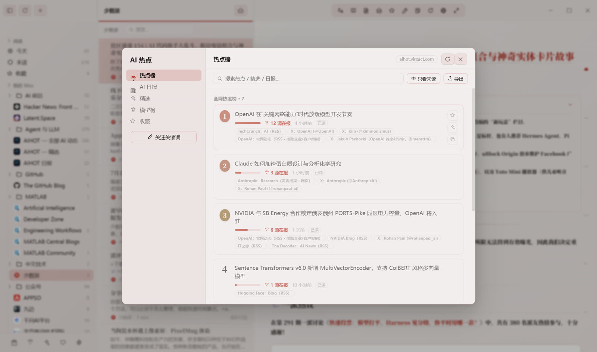</div>

<div align="center">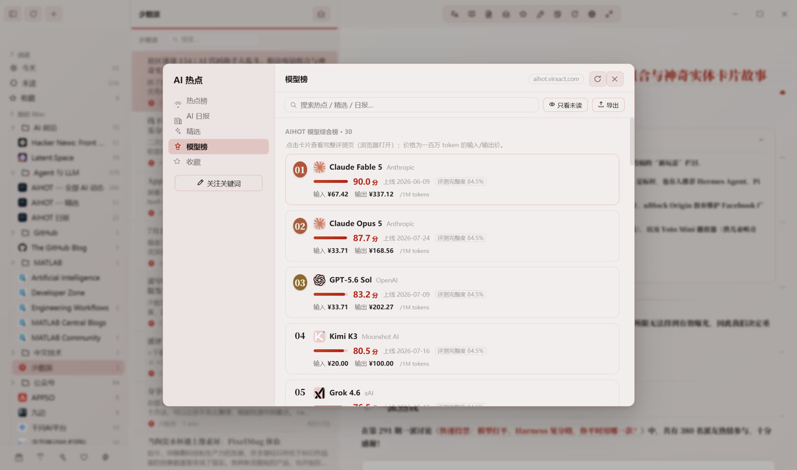</div>

- 全网 AI 热点榜、AI 日报、编辑部精选，热搜来源与在报媒体一目了然
- 大模型综合榜：评分、上线时间、百万 token 输入/输出价格
- 关注关键词，热点自动盯梢；文章打开前预抓取，秒开

### OKLCH 主题设计器

<div align="center">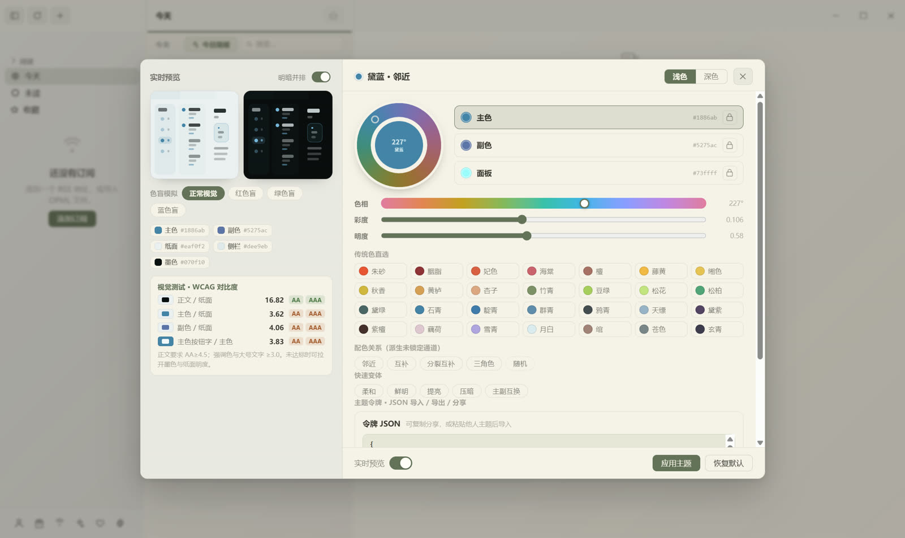</div>

- 基于 OKLCH 色彩空间调色，内置全套中国传统色（朱砂、胭脂、竹青、黛绿、月白……）
- 色觉障碍模拟（红/绿/蓝色盲）、WCAG 对比度实时检测
- 明暗并排实时预览，主题令牌 JSON 导入 / 导出 / 分享

### 还有这些细节

- **神经语音电台**：微软 Neural 真人情感音色（晓晓/云希等，免费需联网），本地语音离线兜底；按句跟随高亮、语速可调（`R` 读/停）；「连播」读完自动接列表下一篇；也支持接入自定义 TTS 服务（OpenAI 兼容 / 局域网 CosyVoice 等）
- **稍后读队列**：与收藏独立的第三状态，读累的文章先存起来慢慢消化
- **AI 探索**：见上方「订阅商店」——输入关键词，AI 去全网发现值得订阅的新源
- **系统托盘**：关闭到托盘常驻后台，刷新发现新文章时系统通知，支持开机自启
- **备份与恢复**：全量数据一键导出为单文件 JSON，随时恢复；存储体积统计与一键清理
- **存储与历史记录**：可设 180 天 / 1 年 / 2 年保留期限，自动淘汰超期已读（未读、收藏、稍后读永不清理），清理后 VACUUM 归还磁盘空间；清理过的文章不会被源站刷新重新灌回
- 中英双语界面，`Ctrl+/` 随时呼出快捷键帮助
- 凭据使用 Windows DPAPI 加密存储，AI API Key 不出本机
- 模型接入：DeepSeek / 任意 OpenAI 兼容 API / 可信局域网 HTTP 服务
- 旧版本升级自动迁移数据目录、偏好与阅读状态，不覆盖新数据

## ⌨️ 键盘快捷键

| 键 | 动作 |
| --- | --- |
| `C` | 开启 / 关闭逐句对照翻译 |
| `V` | 查看 / 生成 AI 摘要 |
| `H` | 快速黄色高亮 |
| `B` `B` | 上一篇（再按一次确认，不循环） |
| `N` `N` | 下一篇（再按一次确认，不循环） |
| `M` | 收藏 / 取消收藏 |
| `R` | 开始 / 停止朗读 |
| `F` | 聚焦模式：非当前段落渐暗，指针所在段保持清晰 |
| `Space` | 向下阅读；到底后切换下一篇 |
| `←` `→` | 三栏之间移动焦点 |
| `Ctrl+Shift+P` | 命令面板：搜索并执行任意功能 |
| `Ctrl+F` | 搜索正文：高亮全部命中，Enter 跳转 |
| `Ctrl+Shift+R` | 刷新全部订阅 |
| `Ctrl + / − / 0` | 正文字号 放大 / 缩小 / 重置 |
| `Ctrl+/` | 快捷键帮助 |

## 📥 下载安装

前往 [**Releases**](https://github.com/suzike/RobinRead/releases/latest) 下载：

| 文件 | 说明 |
| --- | --- |
| `RobinRead-x.y.z-setup.exe` | 安装版，支持自定义安装目录 |
| `RobinRead-x.y.z-portable.exe` | 便携版，解压即用，不写注册表 |

也可以在[官方网站](https://ronbinread-d9gmsqi2vc0a18f04-1401273698.tcloudbaseapp.com/)下载（附 SHA-256 校验值）。

> 全部功能免费开放：订阅源数量与 AI 调用均不限量，无需登录即可使用完整功能（账号体系保留，登录后可同步激活记录）。

系统要求：Windows 10 / 11（x64）。

## 🛠 从源码运行

要求：Node.js 20+（建议 22+）、npm。

```bash
git clone https://github.com/suzike/RobinRead.git
cd RobinRead
npm install
npm start          # 开发运行
npm run dist       # 打包 Windows 安装包 + 便携版（输出到 dist/）
```

首次运行会自动创建本地账户；在工具栏「+」添加 RSS 订阅或导入 OPML，在「设置 → 账号」绑定 FreshRSS，在「设置 → AI 功能」配置 API Key 后启用 AI 能力。

## 📁 目录结构

```
src/
  main/                     # Electron 主进程
    AppStore.js             # 业务中枢
    Models.js               # 数据模型与纯函数
    FeedParser.js           # RSS / Atom / JSON Feed 解析
    FeedService.js          # ETag 条件抓取
    OPMLService.js          # OPML 导入导出
    ArticleExtractor.js     # 网页正文提取 + HTML 白名单消毒
    LLMService.js           # OpenAI 兼容流式客户端 + ArticleChunker
    AihotService.js         # AIHOT 热点/日报/精选/模型榜
    KnowledgeEngine.js      # 知识中心
    EvolutionEngine.js      # 阅读进化
    I18N.js / I18NStrings.js# 中英双语
    UpdateCheckService.js   # 更新检查（默认离线，可自建更新源）
    Account/                # 凭据存储（DPAPI/safeStorage）
    FreshRSS/               # Google Reader API 客户端与认证
    Persistence/            # SQLite（node:sqlite）+ 迁移 + 仓库 + TimelineQueryService
  renderer/                 # 三栏 UI
    views/                  # sidebar / list / reader / settings / store / aihot / knowledge
    styles/robin.css        # 纸感主题（OKLCH 变量驱动）
scripts/
  selftest.js               # 自检（解析/持久化/查询/消毒/UI）
  uitest.js                 # 端到端 UI 交互测试
  verify-realrun.js         # 真机可视全量回归（生产数据副本 + 截图取证）
server/                     # 本地联调服务器（会员/激活 API 的零依赖 mock）
cloudfunctions/njpaper-api  # 云函数版后端（微信登录 / 支付 / 激活码）
website/                    # 官网源码（CloudBase 静态托管）
```

## 🔒 数据与隐私

订阅、文章、阅读状态、批注、AI 配置全部保存在 `%APPDATA%\RobinRead`，卸载不残留云端副本。从旧版本升级时，数据会在首次启动自动迁移，不覆盖新数据。AI 调用直连你配置的模型服务商，本应用不经手、不存储。

## 🏷 版本记录

版本以 GitHub Release 标签管理，与应用版本号保持一致，发布页附带安装包与更新说明：

- **[v2.12.35 — 搜索历史下拉（R26）](https://github.com/suzike/RobinRead/releases/tag/v2.12.35)**（2026-09-29）：列表搜索框补上历史记忆——搜索词按 **Enter 才入史**（输入过程不记半截词），去重且最近在前、上限 5 条；聚焦空框或按 **↓** 呼出毛玻璃下拉（挂搜索框正下方，body 级 fixed 浮层），点选候选即填入并立即搜索，「清除搜索历史」一键清空；滚动列表即收起。浮层层序入谱（600：高于批量条 500、低于期刊 900）。探针 33 项全绿（新增搜索历史 8 断言），实机截图挑剔官三轮收敛 PASS
- **[v2.12.34 — 批量多选场景智能（R25）](https://github.com/suzike/RobinRead/releases/tag/v2.12.34)**（2026-09-29）：**Ctrl+A** 一键全选当前视野（输入框聚焦/期刊打开时不劫持）；批量操作条按视野智能切换——收藏视野主推「**取消收藏**」、稍后读视野主推「**移出稍后读**」（批量移出语义，与加入动作共用同一通道双向参数），默认视野保持批量加入；操作条底色由纯黑灰改为**主题橄榄深调**与应用色系呼应（计数白字 9.06:1 AAA、动作键 6.40:1 AA、「取消选择」补达 AA）。探针 32 项全绿（批量探针扩至 16 断言），实机图挑剔官 PASS
- **[v2.12.33 — 排版面板字号三档 + 命令面板三组定稿（R24）](https://github.com/suzike/RobinRead/releases/tag/v2.12.33)**（2026-09-29）：**期刊排版面板补「字号」行**——小/标准/大三档乘在全局字号（Ctrl+=/−）之上可叠加，分页器实测计算样式自动重排，偏好持久化；面板成五行（行距密度/字号/页边距/栏宽/首字下沉）。**命令面板分组定稿**——补上此前真机缺失的「全局」「来源」组头（形成 期刊→全局→来源 三组），全局命令去掉「打开：」「切换：」「版式预设：」冒号前缀改裸名（今天/未读/收藏/稍后读/知更纸刊…），来源命令改裸源名，跨组动词风格统一；命令图标网格统一钳 15px 线框（newspaper 大图不再撑行，全局组行距回归与期刊组一致的 44px 节奏）。探针 32 项全绿（R1 排版探针扩至 13 断言），实机四图挑剔官终审 PASS（两轮打回收敛：组头补证帧 + 图标节奏修复）
- **[v2.12.32 — 列表批量多选（R23）](https://github.com/suzike/RobinRead/releases/tag/v2.12.32)**（2026-09-29）：几百条文章只能逐条处理成为历史——**Ctrl/Cmd+点击**单选、**Shift+点击**区间选、再点反选，选中行左缘橄榄绿色条+浅绿底一目了然；底部浮出深色毛玻璃批量操作条「已选 N 篇 | 标为已读 | 收藏 | 稍后读 | 取消选择」，一键批设、Esc 或点取消即清；批量走新增的按 id 集合通道（逐条置库+远端账号 outbox 同步、全程只推送一次状态不引发重绘风暴，收藏/稍后读为单向批量加入）。与 R22 的 hover 快捷操作浮条状态叠加互不干扰；列表/杂志视图双支持。探针 32 项全绿（新增批量多选 11 断言），实机截图挑剔官复审 PASS
- **[v2.12.31 — 行内快捷操作 + 命令面板分组（R21-R22）](https://github.com/suzike/RobinRead/releases/tag/v2.12.31)**（2026-09-29）：**R21 命令面板分组小节头**——期刊/全局命令各带组头分隔（小灰字+非首组上缘发丝线），期刊命令去掉「期刊：」前缀改为干净动词（归属信息上移组头），组名可搜索（搜「期刊」直达整组），且搜组名时 label 顺带含组名的命令自动降权（「退出期刊」不再被默认聚焦）；面板列表高度按整行数取整（不再末行切半）。**R22 行内快捷操作**——列表行与杂志卡 hover / 键盘聚焦浮现「已读·收藏·稍后读」三连毛玻璃浮条（走右键菜单同款通路，状态回流刷新），已收藏行星星常亮暖棕、稍后读行时钟常亮主题绿（状态徽记与 meta 行一致），杂志卡浮条压封面右上不遮标题；按钮拦截点击不会误开文章。附探针：R22 八断言 + R21 排序断言全绿，实机截图挑剔官全维度 PASS
- **[v2.12.30 — 发版体检修复：窄栏工具栏换行 + 夜间杂志卡对比度](https://github.com/suzike/RobinRead/releases/tag/v2.12.30)**（2026-09-29）：发版可视化体检揪出两处暗色主题缺陷并修复——① 窄列表栏（约 340px）下工具栏内容溢出 59px 被裁（搜索框右缘被滚动条截平、圆角缺失）：工具栏允许换行，搜索框整颗落到第二行完整显示；② 夜间纸感容器下杂志卡底色被高特异性规则击穿回浅色，标题白字压浅底几乎不可读：补齐暗色覆盖，卡片深色底+亮字恢复对比；另修复封面故事卡未读点缺失（补右上角品牌橙点，与列表卡状态/颜色一致）。附带：命令面板/弹窗在隐藏窗截图中的动画冻结问题于体检脚本层修复
- **[v2.12.29 — 实机反馈：横幅导出超载不再整卡缩小](https://github.com/suzike/RobinRead/releases/tag/v2.12.29)**（2026-09-29）：修复 16:9 等横幅画幅下超载长文被整卡等比缩小到字迹难辨 + 大片留白（三层叠加：横版超载走 contain 缩放、slimLevel 砍光正文板块、自然页 zoom 被内联覆盖）。新策略三级：装得下 → 单/双栏画幅铺满；轻度超载 → **多栏铺满**（头图高度 + 字号/间距双杠杆逐档探测，锁高填充，画幅精确、字号保持）；装不下 → **超载回落长图**（宽度铺满画幅宽、高度随内容、竖版流式排印、内容一段不少——不再缩成小块）。导出 caption 明示当前形态；预览与导出同一渲染产物。e2e 新增超载用例全绿
- **[v2.12.28 — 阅读精细化收官（20 轮迭代 R9-R20）+ 翻页流畅度修复](https://github.com/suzike/RobinRead/releases/tag/v2.12.28)**（2026-09-29）：**R9 栏宽**——排版面板第四组「栏宽」三档（窄 475/标准 540/宽 620）分页同源联动；**R10 封面收尾**——头条图注、日期锚底、无图统计行；**R11 期刊内搜索**——Ctrl+F 搜索条（文章处级计数定位/版面条目跳页）；**R12 快捷收藏/稍后读**——S/L 键即时标记；**R13 当前页导出**——工具条一键截书页高清图到剪贴板；**R14 快捷键速查**——? 呼出 8 行键帽面板；**R15 会话统计**——面板统计行 + 退出小结 toast；**R16 动作音效**——收藏 tick/导出双音/开书纸声变奏；**R17 纸感联动强调色**——四态各档微调日夜双档；**R18 续读提醒**——开书提示已续读至第 N 页；**R19 段落聚焦**——P 键单段沉浸（点击/↑↓ 换段）；**R20 命令面板接入**——期刊命令直达（面板浮于期刊之上）。**性能修复**：折页动画改可见窗口 rAF 驱动（修展开文章滚动卡顿）+ 动画元素引用缓存；文章分叶底部余量与段距建模修正（末行切半）
- **[v2.12.27 — 阅读精细化四连（20 轮迭代 R5-R8）](https://github.com/suzike/RobinRead/releases/tag/v2.12.27)**（2026-09-29）：**R5 灯箱增强**——滚轮缩放（1×–5× 围绕光标）、放大态拖拽平移、双击适应↔2×、键盘 ←/→ 切图、关闭钮与百分比角标，放大态 Esc 先复位再关闭；**R6 版面微交互**——落页卡片错落淡入（45ms 递延、reduceMotion 自动关闭）、卡片 hover 标题转墨绿+头图裁切内微缩放；**R7 封面升级**——期号大字主视觉（64px 衬线数字「总第 N 期」lockup）+ 本期头条大图（自适应钳高、无图回退纯排版）；**R8 滑轨分段 + 目录树状**——滑轨头条栏目边界细分隔线（拇指/分段/刻度三级高度层次），文章目录 h2/h3 树状缩进 + 当前节单行锚定（翻页同步移动）+ 列表底部渐隐
- **[v2.12.26 — 阅读精细化四连（20 轮迭代 R1-R4）](https://github.com/suzike/RobinRead/releases/tag/v2.12.26)**（2026-09-28）：**R1 阅读排版面板**——工具条 Aa 弹出三档行距密度/三档页边距/首字下沉开关，即时生效并持久化（版面卡片与文章模式双链路生效）；**R2 纸张四态**——新增「牛皮」纸态（黄褐纤维感日夜双套色板），夜间纸色独立记忆（magPaperDark 与日间分键，夜间未设置回退日间值），书脊压痕/纸叠层次/期号「总第 N 期」封面升级，书页下外角 folio 页码；**R3 划词工具条**——期刊内划选正文或卡片文本浮出「复制/解释/翻译/提问」胶囊，AI 弹层流式渲染（复用 ai:* 通道），复制走主进程剪贴板后台窗不失败，Esc 优先关弹层；**R4 阅读进度**——滑轨常显「本期约剩 N 分钟 · P/T」（末页变已读完），文章进度线右端「本文约剩 N 分钟」随页递减；另修文章分页装箱段距低估（末叶正文压纸缘切半行）与进度线亚像素不可见
- **[v2.12.25 — 纸声修复 + 画幅三级自适应](https://github.com/suzike/RobinRead/releases/tag/v2.12.25)**（2026-09-28）：翻页纸声修复（此前被裁到 0.32s 几不可闻 → 恢复上游完整 0.77s + loudnorm 响度归一 + 音量 0.85）；导出卡片画幅三级自适应定稿——内容不足自动放大铺满、轻超密排重排、重超整卡等比缩放、极限超载回落自然高度长图（任何内容量都完整不裁切，状态明确）；中缝立体感增强（24px 凹面渐变）、文章页段落节奏微调
- **[v2.12.24 — 实机反馈三连修](https://github.com/suzike/RobinRead/releases/tag/v2.12.24)**（2026-09-28）：杂志卡片摘要 HTML 标签泄露修复（RSS 摘要含片段 HTML → 剥标签+解实体只显纯文本，标题/来源同步处理）；版心改比例自适应（随窗口 92% 连续缩放，上限 2100——小屏满铺、大屏不再大片留白）；修复向前翻页卡死（动画终点写反，点左区/滚轮/方向键向前翻恢复）
- **[v2.12.22 — 订阅商店 Tidings 专题 + 预览画幅修复](https://github.com/suzike/RobinRead/releases/tag/v2.12.22)**（2026-09-28）：订阅商店接入 Tidings 精选目录（github.com/fuxiaoai/tidings-rss，CC0）——14 个专题、306 个三轮解析验证的源（精选/独立博客/技术周刊/公众号/大厂技术/AI/安全/科技媒体/新闻/科研/视频/播客/社区/工程），与既有目录去重合并共 554 源；修复预览弹窗固定画幅下长文被裁切的回归——contain 缩放改 transform 实现，填充/紧凑分支与导出管线全量对齐，预览与导出所见即所得
- **[v2.12.20 — 细节打磨 VI](https://github.com/suzike/RobinRead/releases/tag/v2.12.20)**（2026-09-28）：灯箱升级画廊（全篇图片左右切换循环+计数+键盘）、「有声/静音」翻页音效开关（右上角持久化）、沉浸全屏（F 键或右上角按钮）、翻页拖拽与文字选择冲突防护（启动翻页自动清选区+禁图片原生拖拽）
- **[v2.12.19 — 细节打磨 V](https://github.com/suzike/RobinRead/releases/tag/v2.12.19)**（2026-09-28）：折页动画低端机帧率自适应（连续掉帧自动回退淡入，会话级）、文章正文字号跟随全局偏好（Ctrl+= / − 实时生效并自动重排）、目录面板当前节高亮并滚动定位
- **[v2.12.18 — 细节打磨 IV](https://github.com/suzike/RobinRead/releases/tag/v2.12.18)**（2026-09-28）：期刊阅读位置记忆（同一视野重开落到上次离开的页，per-scope 持久化）、文章目录面板（长文页眉「目录」按钮弹出节标题列表点击跳页，keep-with-next 无孤行）、版面卡片右键菜单（稍后读/收藏等快捷操作透传列表菜单）
- **[v2.12.16 — 细节打磨 II](https://github.com/suzike/RobinRead/releases/tag/v2.12.16)**（2026-09-28）：同窗口导航防护（正文链接点击不再有替换应用窗口风险，一律转系统浏览器）、滑轨悬停预览锚定当前刻度并随拖动跟随、正文视频补播放控件、阅读器进入淡入、图片比例实例缓存（窗口重排零等待）
- **[v2.12.15 — 细节打磨](https://github.com/suzike/RobinRead/releases/tag/v2.12.15)**（2026-09-28）：期刊翻页细节五连——文章模式滑轨悬停预览（此前为空）显示两叶首节标题、封面加期号日期、正文图片点击灯箱放大（Esc 关闭，开启时屏蔽误翻页）、开书后释放封面克隆 DOM、页眉长标题截断省略
- **[v2.12.14 — 实机反馈四连修](https://github.com/suzike/RobinRead/releases/tag/v2.12.14)**（2026-09-28）：文章翻页模式正文全文治理（needsExtraction 抓取/过短补全/摘要兜底，不再只有一点点）+ 分页器递归展平容器 + 正文图片按真实比例预留（不再 cover 裁切）+ 节标题 keep-with-next；纸张三态切换修复（列表按钮闭包 bug）+ 阅读器内右上角直接切换（纸感/素白/书卷）；精读卡片画幅内容完整性——横版 prose 永不删、multicol 丢内容根因修复（auto 布局+contain 缩放），任何画幅内容完整
- **[v2.12.13 — 实机反馈三连修](https://github.com/suzike/RobinRead/releases/tag/v2.12.13)**（2026-09-28）：期刊书页放大（版心 1480+留白收紧）、视觉精细化（纸张纤维噪点+书桌暗角+多层书影+页眉精修）、点击文章在翻页界面内以正文翻页模式阅读（页眉返回+页码+keep-with-next 排版）；精读卡片画幅 fit-to-fill——画幅为硬约束，内容不足自动放大间距/行距/头图+弹性补空，超出自动紧凑化，预览与导出所见即所得
- **[v2.12.12 — 期刊翻页 2.0 全面对标上游](https://github.com/suzike/RobinRead/releases/tag/v2.12.12)**（2026-09-28）：逐细节移植 PaperRss v1.4.5 杂志模式——双页对开版面引擎（版心/中缝/字号分级/组合规则/叶尾收口/背封页）、拖拽跟手折页翻页（corner 随机+呼吸缓动+书脊光影+纸声）、封面书脊开合+自动开页、页码滑轨（波浪悬停+拖拽跳页+目录预览）、三分区点击+滚轮+方向键遥控导航
- **[v2.12.11 — 期刊翻页重做](https://github.com/suzike/RobinRead/releases/tag/v2.12.11)**（2026-09-28）：复刻上游翻页视觉语义（CSS 3D 纸页翻转+四档随机预设+呼吸缓动）
- **[v2.12.10 — 实机修复](https://github.com/suzike/RobinRead/releases/tag/v2.12.10)**（2026-09-28）：修复期刊阅读正文 [object Object]、修复横版预览白屏
- **[v2.12.9 — 全屏沉浸排版](https://github.com/suzike/RobinRead/releases/tag/v2.12.9)**（2026-09-28）：简报全屏单栏限宽沉浸+报头仪式感、导出侧栏重构、横版满宽长图、历史配置移除
- **[v2.12.8 — 简报响应式与期刊阅读](https://github.com/suzike/RobinRead/releases/tag/v2.12.8)**（2026-09-28）：简报全屏三档响应式、期刊翻页阅读 MVP、历史配置移除
- **[v2.12.7 — 侧栏重构与真实频谱](https://github.com/suzike/RobinRead/releases/tag/v2.12.7)**（2026-09-28）：导出弹窗侧栏重构（常用平铺+更多设置折叠）、标题自动译中文、真实频谱音浪、翻页过渡打磨
- **[v2.12.6 — 借鉴上游 v1.4.4/v1.4.5](https://github.com/suzike/RobinRead/releases/tag/v2.12.6)**（2026-09-27）：正文图片失败自动重试、杂志纸张质感三选、AI 摘要一键复制、TTS 播放音浪
- **[v2.12.5 — 设置页与设计器精修](https://github.com/suzike/RobinRead/releases/tag/v2.12.5)**（2026-09-27）：分区导航指示条、设置行悬停、分组圆角、设计器侧栏与滑轨精修
- **[v2.12.4 — 热点榜与商店精修](https://github.com/suzike/RobinRead/releases/tag/v2.12.4)**（2026-09-27）：AIHOT 悬停浮起/前三名暖色排名、商店侧栏指示条统一
- **[v2.12.3 — 正文组件精修](https://github.com/suzike/RobinRead/releases/tag/v2.12.3)**（2026-09-27）：AI 摘要卡强调色侧线渐变纸面、高亮柔角悬停投影、双语卡圆角纸底、悬浮胶囊玻璃拟态
- **[v2.12.2 — 导出弹窗修复](https://github.com/suzike/RobinRead/releases/tag/v2.12.2)**（2026-09-27）：修复导出弹窗运行时崩溃（E2E 探针揪出的引用错误）
- **[v2.12.1 — 批量导出](https://github.com/suzike/RobinRead/releases/tag/v2.12.1)**（2026-09-27）：打包全部模板一键 ZIP；修复保存 HTML 死按钮
- **[v2.12.0 — 卡片 2.0 十轮收官](https://github.com/suzike/RobinRead/releases/tag/v2.12.0)**（2026-09-27）：JPEG 高质量导出、保存 HTML、内容长度三档、封面取色色带、画幅种子渐变衬底（C4/C7/C8 收官，累计 10 轮 22+ 功能）
- **[v2.11.2 — 卡片 2.0 C6+C9](https://github.com/suzike/RobinRead/releases/tag/v2.11.2)**（2026-09-27）：Ctrl+S/C 快捷键、卡上双击编辑、历史配置重现、模板收藏置顶、横版双栏自适应
- **[v2.11.1 — 卡片 2.0 C3+C5](https://github.com/suzike/RobinRead/releases/tag/v2.11.1)**（2026-09-27）：封面滤镜四款、排版密度三档、字体搭配三套、水印样式切换
- **[v2.11.0 — 精读卡片 2.0 开篇](https://github.com/suzike/RobinRead/releases/tag/v2.11.0)**（2026-09-27）：平台尺寸预设（1:1/4:3/16:9/2.35:1 等 7 种画幅）；配色变体系统（4 色系一键换色，导出全链路生效）
- **[v2.10.4 — 简报全屏报纸版面](https://github.com/suzike/RobinRead/releases/tag/v2.10.4)**（2026-09-27）：报头通栏大字日期、主题卡双栏、正文限宽居中、滚动条精修
- **[v2.10.3 — 生成式封面与简报修复](https://github.com/suzike/RobinRead/releases/tag/v2.10.3)**（2026-09-27）：十款生成式封面（无图也有设计感）；简报全屏/排版精修级联修复；看板标签计数修复
- **[v2.10.2 — 知识中心统一与连击](https://github.com/suzike/RobinRead/releases/tag/v2.10.2)**（2026-09-27）：知识中心卡片视觉统一（来源眉题/悬停浮起）；目标环连击徽章（火苗+N 天连击）
- **[v2.10.1 — 文章刊头精修](https://github.com/suzike/RobinRead/releases/tag/v2.10.1)**（2026-09-27）：来源眉题行（字距小标尺+短线）、标题平衡断行、阅读时长胶囊、双线分隔
- **[v2.10.0 — 主界面精修](https://github.com/suzike/RobinRead/releases/tag/v2.10.0)**（2026-09-27）：侧栏选中指示条/计数胶囊/favicon 描边；列表行呼吸感/未读加粗；悬停过渡统一
- **[v2.9.9 — 阅读目标与视觉精修](https://github.com/suzike/RobinRead/releases/tag/v2.9.9)**（2026-09-27）：每日阅读目标+SVG 渐变进度环（知识看板，达成点亮）；设置可调目标篇数；细滚动条/全局选区/空状态视觉精修
- **[v2.9.8 — 数据口径统一](https://github.com/suzike/RobinRead/releases/tag/v2.9.8)**（2026-09-27）：统计/热力图/每日回顾日期键统一本地时区；渐进渲染期 loadMore 抑制；冗余样式清理
- **[v2.9.7 — 数据可视化升级](https://github.com/suzike/RobinRead/releases/tag/v2.9.7)**（2026-09-27）：阅读热力图年度化（365 天/今日描边/年度统计）；看板新增来源 Top 榜与时段分布；精读卡片封面质感升级（极简白/晨读手帖）
- **[v2.9.6 — hero 全覆盖与简报精修](https://github.com/suzike/RobinRead/releases/tag/v2.9.6)**（2026-09-27）：hero 封面扩展至 8 款模板（mag/news 纯图带防重题）；今日简报排版精修（报头双线/分节层级/全屏阅读态）
- **[v2.9.5 — 精读修复](https://github.com/suzike/RobinRead/releases/tag/v2.9.5)**（2026-09-27）：修复 v2.9.4 一键精读必然失败（deepReadSystem 定义错位）
- **[v2.9.4 — 卡片 hero 封面与精读人格](https://github.com/suzike/RobinRead/releases/tag/v2.9.4)**（2026-09-27）：精读卡片杂志级 hero 封面（全出血大图+蒙版压题，霞光/晨雾/知更书页三款重构）；AI 精读人格 6 种可选（含自定义提示词，人格参与缓存自动重写）；今日简报 v3（精读版逐篇解读 + 弹窗全屏 + 双版切换）
- **[v2.9.3 — 神经语音播放修复](https://github.com/suzike/RobinRead/releases/tag/v2.9.3)**（2026-09-27）：修复 CSP 拦截音频 data URI 导致试听与朗读必然失败（合成一直正常，问题在播放）；修复版式预设行高旋钮不生效
- **[v2.9.2 — 十款卡片模板与应用内更新](https://github.com/suzike/RobinRead/releases/tag/v2.9.2)**（2026-09-27）：精读卡片扩展至 10 款（新增霞光/晨雾/蓝图/青瓷，六款配色升级）；神经语音修复（自动重试、失败不再回退本地语音）；聚焦模式修复；应用内在线更新（检查→下载→静默安装）；关于页显示当前版本
- **[v2.9.1 — 十轮前端打磨收口](https://github.com/suzike/RobinRead/releases/tag/v2.9.1)**（2026-09-27）：设计令牌体系 v2（间距/圆角/阴影/动效全令牌化）、阅读控制中心（单一 Aa 浮层整合全部阅读参数）、命令面板 2.0（记分排序+最近使用）、灯箱多图画廊导航（缩略图条+←→键）、复习会话键盘化、可访问性收敛（focus-visible/减少动效/WCAG 对比度达标）、修复精读卡片极简白模板标题竖排塌陷
- **[v2.9.0 — 每源排版与复习会话](https://github.com/suzike/RobinRead/releases/tag/v2.9.0)**（2026-09-26）：每源排版偏好（字体/字号/页宽源级覆盖）、搜索定位闭环（搜到即读到命中处）、SM-2 复习会话、自动每日备份
- **[v2.8.0 — 继续阅读与导出矩阵](https://github.com/suzike/RobinRead/releases/tag/v2.8.0)**（2026-09-26）：「继续阅读」卡片一键恢复未读完的文章；灯箱滚轮缩放/拖拽平移/保存图片；单篇 HTML 导出；文章头部标签 chips；稍后读超龄行标与快读标记；阅读进度百分比
- **[v2.7.0 — 知识图谱与文章内搜索](https://github.com/suzike/RobinRead/releases/tag/v2.7.0)**（2026-09-26）：知识图谱可视化、问知识库（高亮+笔记 RAG 问答）、文章内搜索（Ctrl+F）、朗读段落点击跳播、自动滚动、短文优先排序、标签筛选列表
- **[v2.6.0 — 神经语音电台](https://github.com/suzike/RobinRead/releases/tag/v2.6.0)**（2026-09-26）：微软 Neural 真人情感朗读（8 款中文音色）+ 连播放列表，自定义 TTS 服务接入；智能稍后读（超龄一键清理）；纸刊级打印精排
- **[v2.5.0 — 排版引擎与每日刊](https://github.com/suzike/RobinRead/releases/tag/v2.5.0)**（2026-09-26）：报纸级中文排版引擎（盘古之白/标点挤压/缩进/首字下沉）、内置霞鹜文楷与得意黑、每日刊头与整期 EPUB 导出、同题 AI 对比速读、精读卡片导出、命令面板、聚焦模式、自定义 CSS
- **[v2.4.2 — 公众号刷新修复](https://github.com/suzike/RobinRead/releases/tag/v2.4.2)**（2026-08-31）：抓取走系统代理，被屏蔽的公众号桥与境外源可达；手动刷新强制全量
- **[v2.4.1 — AI 探索领域词修复](https://github.com/suzike/RobinRead/releases/tag/v2.4.1)**（2026-08-31）：候选池覆盖不足的领域由 AI 外扩提议站点
- **[v2.4.0 — AI 探索与全场景阅读](https://github.com/suzike/RobinRead/releases/tag/v2.4.0)**（2026-08-31）：AI 探索、TTS 听文章、稍后读、Miniflux 同步、托盘与备份、英文界面全量
- **[v2.3.0 — 性能与阅读体验跃升](https://github.com/suzike/RobinRead/releases/tag/v2.3.0)**（2026-08-31）：13 项缺陷修复、抓取独立进程、状态推送瘦身、FTS5 全文搜索
- **[v2.2.0 — 开源基线](https://github.com/suzike/RobinRead/releases/tag/v2.2.0)**（2026-08-29）：仓库首个 Release，与客户端构建 v2.2.0 同版本号
- 更早的构建历史见 [CHANGELOG.md](CHANGELOG.md)

## 📄 许可证

本项目基于 [GPL-3.0](LICENSE) 协议开源，欢迎自由使用、修改与二次分发。

<div align="center">
  <sub><a href="https://ronbinread-d9gmsqi2vc0a18f04-1401273698.tcloudbaseapp.com/">ronbinread · tcloudbaseapp.com</a> — 双语流转，克制智能化</sub>
</div>
